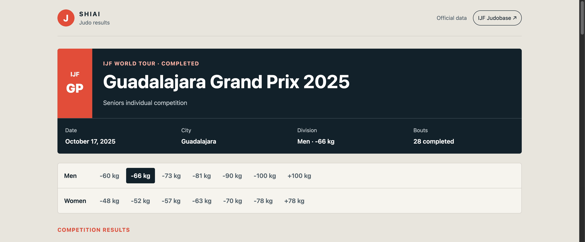

# SHIAI — IJF Judo Results

SHIAI is a judo results app built for an educational frontend assignment. It loads official match data from the public International Judo Federation data service.



## Stack

Runtime dependencies:

- React
- React DOM
- React Router

Development dependency:

- Vite
  used to test the app locally in the browser during development

## API

Data comes directly from the public IJF endpoint:

```text
https://data.ijf.org/api/get_json
```

`src/api.js` uses two API actions:

- `competition.categories_full` loads the available men's and women's weight classes.
- `contest.find` loads a division's matches or one detailed match scorecard.

The selected event is Guadalajara Grand Prix 2025 (`id_competition=3081`). Only the event identifier and default weight-class identifier are configuration constants; names, countries, results, scores, rounds, and match details come from the API response.

No API key, account, or `.env` file is needed. The app needs internet access to load results. The IJF actions are based on the website's requests rather than a published API reference, so the service may change.

Names are displayed as returned by the API. A winner is shown only when the API's winner ID matches an athlete. Otherwise, the match page displays "Winner unavailable".

## Run locally

Requirements: Node.js 22.13 or later.

Download and extract the ZIP, then open a terminal in the folder containing `package.json`. Install the dependencies and start the app:

```bash
npm install
npm run dev
```

Open the local address printed in the terminal, normally `http://localhost:5173/`. Keep the terminal open while using the app. Press **Ctrl+C** to stop it.

Create a production build with:

```bash
npm run build
```

This creates the `dist/` folder. Run `npm run preview` to check the production build locally.

The ZIP contains the source files and the lockfile. `npm install` installs the dependencies for your operating system.

## How it works

1. A weight-class link changes the URL to `/weights/:weightId`.
2. React Router runs the route loader in `main.jsx`.
3. The loader calls a function in `api.js`, which uses native `fetch()`.
4. The page in `App.jsx` reads the returned data with `useLoaderData()`.
5. A match link opens `/matches/:contestCode` and loads one detailed scoreboard.

The root route loads the weight categories once on the initial visit; React Router manages when that data needs to be loaded again. `NavLink` marks the active division. `useNavigation()` controls the navigation progress bar, and route errors display an error page.

## Project structure

```text
src/
  api.js       IJF URL construction and fetch functions
  main.jsx     React Router configuration and loaders
  App.jsx      Shared layout, results, match, loading, and error pages
  styles.css   Plain CSS design
public/
  favicon.svg  Static app icon
resources/
  recording.gif Demo gif  
```
